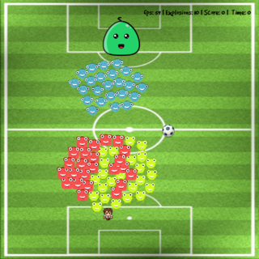
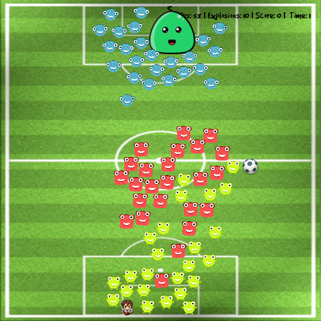
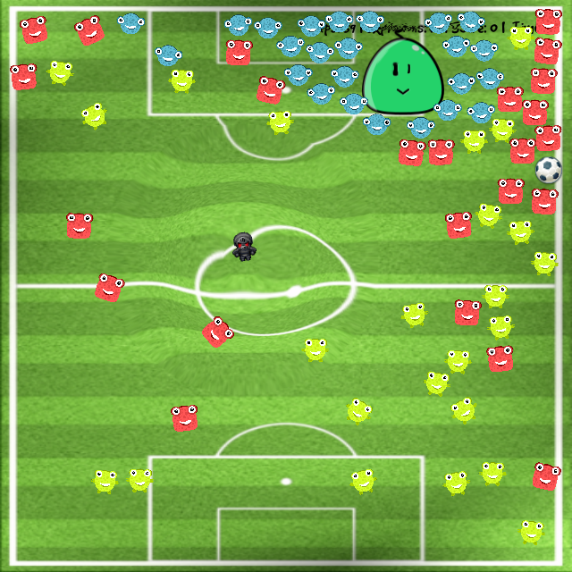

# Banania

Requirements
======

Cython>=0.15
Kivy


## Install

Windows
------
```python
python cymunk/setup.py build_ext --inplace
```

Linus / Mac OS
------
```python
cd cymunk/
make
cd ..
```

Run 
======
```python
kivy main.py
```

Screenshots
======
 "Screenshot of the game 1")
 "Screenshot of the game 2")
 "Screenshot of the game 3")

