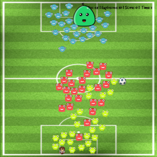
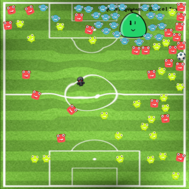

# Banania

This a 2D game I am developing on my spare time.
The concept is the following: 
You control the hero with the mouse and your goal is to hit the Big monster with the ball. 
Smaller monsters will try to prevent you from doing that.

Requirements
======

- Cython>=0.15
- Kivy

```sh
pip install kivy cython
```
Should do it.

## Install

Windows
------
```sh
make
```

Linux / Mac OS
------
```sh
make
```

Run 
======
```sh
kivy main.py
```

Controls
=====
- Clic and slide to move the hero.
- Double tap for special skill (see screenshot).

Screenshots
======





